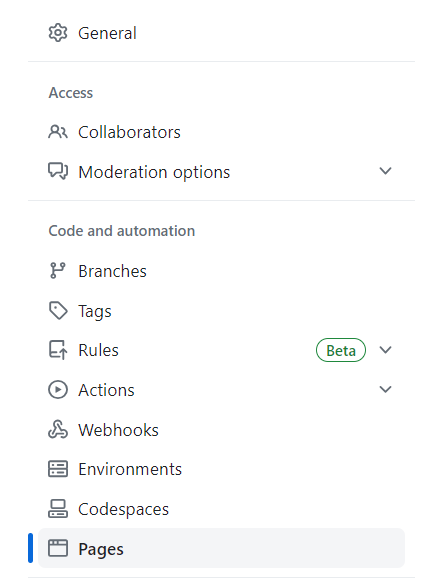
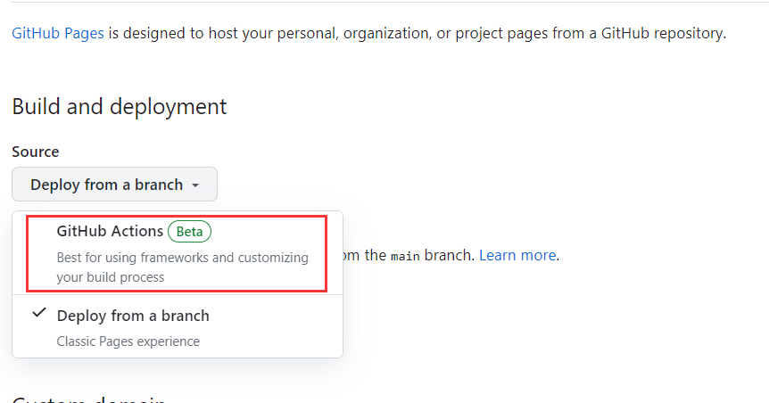

### 前言

谨以此文，详细介绍一下搭建这个博客的历程。


俗话说得好，不要重复造轮子。如果从头开始写html、css、js，然后找云服务器部署，时间成本、金钱成本都很高。使用现成的、开箱即用的框架，能够把文章扔进去就显示在网页上，是最理想的部署方案。


经过简单调研，选择部署方案如下：

- 静态网站，不用数据库
- 在github仓库上传代码，利用github自动部署
- Jekyll 框架
- Chirpy主题


### 环境准备

#### 远程

github

#### 本地环境配置（wsl）

###### apt 依赖项安装

```bash
sudo apt-get install ruby-full build-essential zlib1g-dev
```

###### 为自己的用户账户配置gem的安装目录

```
echo '# Install Ruby Gems to ~/software/gems' >> ~/.bashrc
echo 'export GEM_HOME="$HOME/software/gems"' >> ~/.bashrc
echo 'export PATH="$HOME/software/gems/bin:$PATH"' >> ~/.bashrc
source ~/.bashrc
```

###### 安装 Jekyll 和 Bundler

```
gem install jekyll bundler
```

###### ruby 换源

如果网络环境不好，可以换ruby的国内镜像源

```
bundle config mirror.https://rubygems.org https://gems.ruby-china.com
```


### 首次部署过程

##### 1.在github上创建仓库

仓库名为`<username>.github.io`，把`<username>`替换为自己的用户名

##### 2.建立本地仓库

从[chirpy-starter](https://github.com/cotes2020/chirpy-starter)仓库克隆模板：

```bash
git clone https://github.com/cotes2020/chirpy-starter
```

进入仓库，移除原有的远程库：

```bash
cd chirpy-starter/
git remote remove origin
```

添加自己的远程库：

```bash
git remote add origin https://github.com/<username>/<username>.github.io.git
git branch -M main
git push -u origin main
```


##### 3.配置github仓库

进入Settings，在左侧选择Pages选项卡：



在右侧的Build and deployment 中选择 Github Actions




##### 4.修改配置文件

主要修改`._config.yml`

要修改的的地方：

```yaml
lang: zh-CN
timezone: Asia/Shanghai
title: Ding's Blog # it will display as the title
tagline: Reading, Coding, Thinking # it will display as the description
description: >- # used by seo meta and the atom feed
  A minimal, responsive and feature-rich Jekyll theme for technical writing.
url: "https://<username>.github.io"

github:
  username: <username> # change to your github username
  
social:
  # Change to your full name.
  # It will be displayed as the default author of the posts and the copyright owner in the Footer
  name: <name>
  email: <email> # change to your email address
  links:
    - https://github.com/<username> # change to your github homepage
```


##### 5,在本地测试运行效果

```bash
bundle exec jekyll s
```

或

```
bundle exec jekyll serve
```

就可以在[http://localhost:4000](http://localhost:4000/)访问网站查看效果

##### 6.部署

```bash
git add .
git commit -m "message"
git push
```

远程仓库更新之后，等半分钟左右的时间，会自动完成部署。


### 创建新文章


### 参考链接

Jekyll 的安装手册

https://jekyllrb.com/docs/installation/


chirpy的官方教程

https://chirpy.cotes.page/posts/getting-started/

